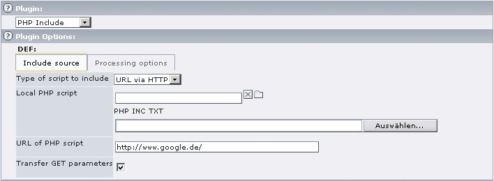
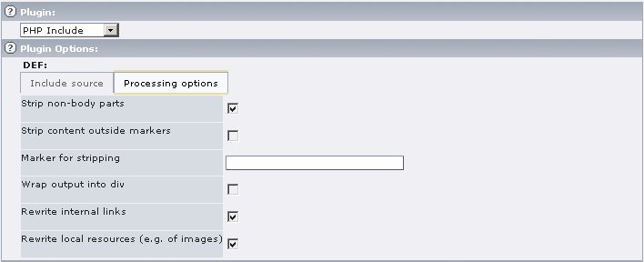

.. ==================================================
.. FOR YOUR INFORMATION
.. --------------------------------------------------
.. -*- coding: utf-8 -*- with BOM.

.. include:: ../Includes.txt

.. _users-manual:

Users manual
============

The extension provides a frontend plugin with an options form to control the integration of the external script.

	Options for integration of a remote script

- Add a new content element of type plugin „PHP Include“ to the desired page.
- Choose the type of included script, enter the URL or select/upload a local file and set the desired parameters. If you
  call a remote script, you might want to check the „Strip non-body parts“ marker to get a valid HTML result page. If
  you even have markers set in the script, you can use the „Strip content outside markers“ option along with the input
  field labeled „Marker for stripping“. The marker must be of the form ``<!-- MARKER -->``.

  **Note: This marker is not related in any way to the commonly used markes in extension or page templates!**
- To adjust the display of the included code you can use „Wrap output with div“ and have another ``div`` tag wrapped
  around the content to apply additional CSS directives on it. The class of the ``div`` tag is
  ``tx_lumophpinclude_<MD5 hash of included file name>``.
- Call the page in the frontend and check the results.

Explanation of the processing options
-------------------------------------

	Processing options for included scripts

The following processing options are available for all types of included scripts:

- **Strip non-body parts**: Remove everything outside the body tag (including the tag itself) from the fetched script
  result.
- **Strip content outside markers**: Strip everything outside the set markers from the fetched script result.
- **Marker for stripping**: Marker for stripping; must be of the form ``<!-- MARKER -->``
- **Wrap output into div**: have another ``div`` tag wrapped around the content to apply additional CSS directives on it.
  The class of the div tag is ``tx_lumophpinclude_<MD5 hash of included file name>``.

The following options are only available for remote scripts:

- **Rewrite internal links**: Change the URL of internal links (i.e. links whose URL does not have a host specified) to
  point to the same TYPO3 page; the new URL is the added as the URL parameter ``tx_lumophpinclude_url``; this way, you
  can include a whole website.
- **Rewrite local resources (e.g. of images)**: Change the URL of all ``src`` attriubutes in the fetched script result to
  point to the original server to have images displayed correctly though the HTML is displayed on your own page
